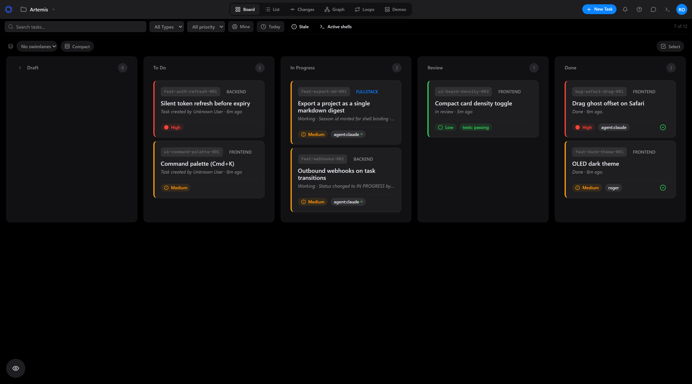
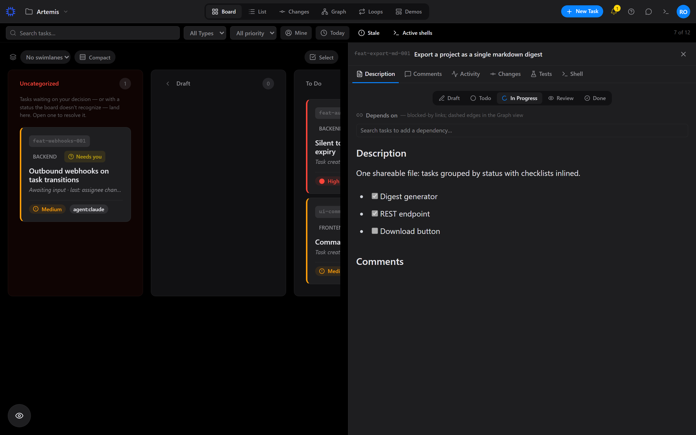
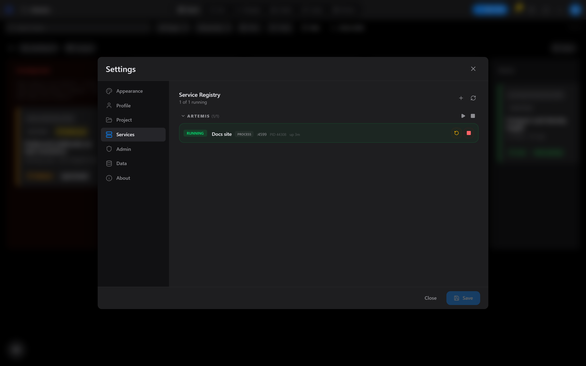
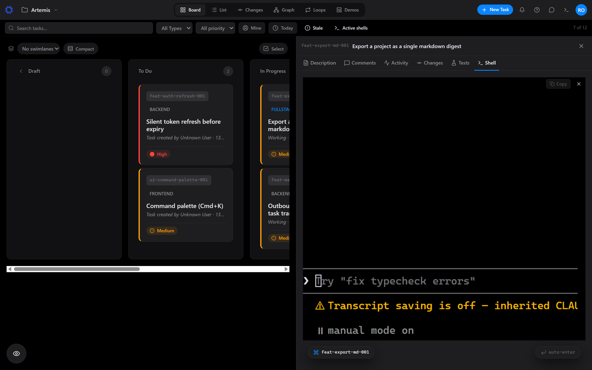
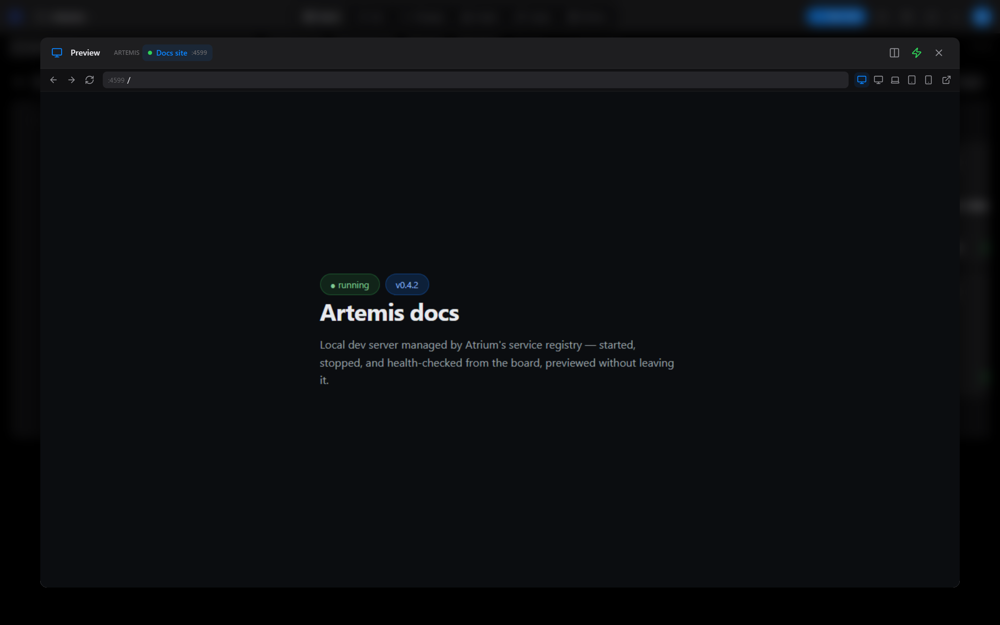
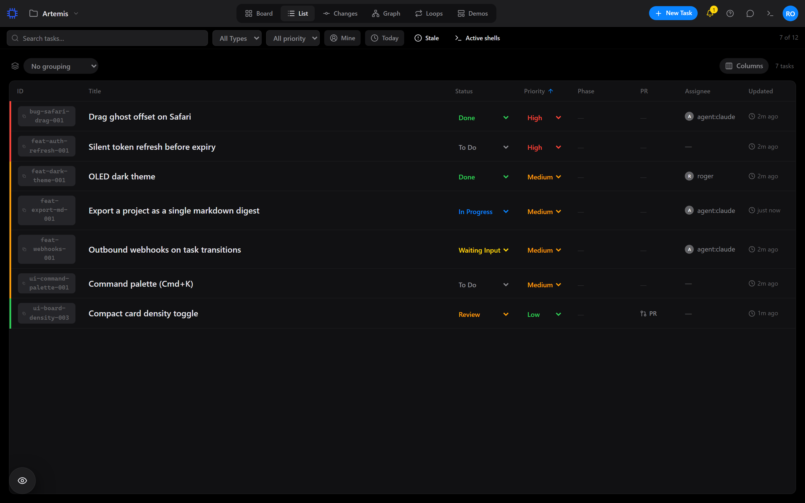

# Atrium

> **AI-orchestrated task board with strict agent protocol, MCP server, approval checkpoints, and phased-task templates — built and used daily with Claude Code.**

A Kanban-style task management system built for autonomous AI developer agents. See the live project tour at [wiki.r-that.com/projects/atrium](https://wiki.r-that.com/projects/atrium/) and the full agent-task-board protocol at [wiki.r-that.com/patterns/agent-task-board-protocol](https://wiki.r-that.com/patterns/agent-task-board-protocol/).

Atrium gives humans a visual control plane for AI coding agents. Tasks live as Markdown files with YAML frontmatter -- readable by both humans and machines. Agents pick up work through a REST API, update status as they go, and leave structured comments documenting their reasoning. Humans review completed work and control the final approval step.

The board also doubles as a lightweight DevOps dashboard: register your services, start and stop them from the UI, open an embedded terminal, and preview running frontends -- all without leaving the browser.

---

## Features

### Task Management
- Four-column Kanban board (Todo, In Progress, Review, Done) with drag-and-drop
- Multiple views: Board, List, and Tree
- Swimlane grouping by assignee, type, or priority
- Bulk operations on multiple tasks at once
- Undo/redo support for task changes
- Advanced filtering by type, priority, assignee, and free-text search
- Task templates for repeatable work
- Full activity logging and audit trail with automatic timestamps

### Real-Time Collaboration
- Live updates via WebSockets -- every connected client sees changes instantly
- Real-time chat between users and agents
- Live presence indicators showing who is viewing each task

### Developer Tools
- Embedded terminal powered by xterm.js and node-pty
- Service registry to start, stop, and restart dev servers from the UI
- Preview panel for iframing running services directly in the board
- Swagger/OpenAPI documentation for the full REST API

### Architecture
- File-based task storage using Markdown with YAML frontmatter -- no database required
- Task revision history stored as timestamped snapshots
- JWT authentication with role-based access control
- Rate limiting on API endpoints
- Structured logging with Pino
- Mobile responsive design

---

## Tech Stack

### Frontend


| Library | Purpose |
|---------|---------|
| React 19 | UI framework |
| Vite 8 | Build tooling and dev server |
| Tailwind CSS 4 | Utility-first styling |
| @hello-pangea/dnd | Drag-and-drop for the Kanban board |
| @xterm/xterm | Embedded terminal emulator |
| @tanstack/react-virtual | Virtualized lists for large task sets |
| Socket.IO Client | Real-time WebSocket communication |
| lucide-react | Icon library |
| react-markdown + remark-gfm | Markdown rendering in task descriptions |
| Storybook 10 | Component development and documentation |
| Vitest + Playwright | Unit and end-to-end testing |

### Backend


| Library | Purpose |
|---------|---------|
| Express 5 | HTTP framework |
| Socket.IO 4.8 | Real-time event broadcasting |
| gray-matter | Parse Markdown files with YAML frontmatter |
| node-pty | Spawn terminal processes for the embedded shell |
| Pino | Structured JSON logging |
| jsonwebtoken + bcryptjs | Authentication and password hashing |
| swagger-jsdoc + swagger-ui-express | Auto-generated API documentation |
| express-rate-limit | Request throttling |

---

## Getting Started

Atrium runs two ways. **Docker is the recommended path** — one command, one port,
and the whole toolchain (backend, built frontend, git/gh, a shell) baked into the
image. The native path is for hacking on Atrium's own code.

### Quickstart (Docker)

Prerequisites: Docker Desktop, or Docker Engine + Compose.

```bash
git clone https://github.com/RogerSquare/atrium.git
cd atrium
cp .env.example .env
# Edit .env and set the two required values:
#   JWT_SECRET       — node -e "console.log(require('crypto').randomBytes(48).toString('base64'))"
#   ATRIUM_WORKSPACE — absolute path to the folder that holds your repos
docker compose up -d
```

Open **http://localhost:3001** (or whichever `ATRIUM_PORT` you set). The full
walkthrough — optional compose overrides, ports, troubleshooting — is in
[docs/install.md](docs/install.md).

> **Claude Code note:** the default compose also mounts your `~/.claude` so a
> terminal *inside* the container can run `claude`. If you don't use Claude Code,
> those mounts are optional — see [docs/install.md](docs/install.md).

### First run

1. **Register the first account.** The first user created is automatically the
   **admin**; everyone after is a regular member.
2. **Point Atrium at your projects.** The first-run wizard (or Settings →
   Project) sets the working directory; in the container it defaults to the
   `/workspace` mount.
3. **Connect an agent (optional).** Mint an agent token in Settings → Agent
   Tokens (admin-only, shown once), then run the setup CLI on the machine where
   your agent runs:
   ```bash
   node backend/cli/atrium-mcp-setup.js --token <agent-token> --url http://localhost:3001
   ```
   It probes the running instance, installs the Atrium skill, and registers the
   MCP server. See [docs/agents.md](docs/agents.md) for the agent contract
   (including non-Claude agents over plain REST) and [docs/mcp.md](docs/mcp.md).

### Native (development)

For working on Atrium itself. Requires **Node 18+** and a **C++ toolchain** for
`node-pty` (Windows: VS Build Tools; macOS: `xcode-select --install`; Linux:
`sudo apt install build-essential`).

```bash
# Terminal 1 — backend (:3001)
cd backend && npm install && npm start

# Terminal 2 — frontend (:5173, proxies /api -> :3001)
cd frontend && npm install && npm run dev
```

`settings.json`, `services.json`, and `projects.json` are **auto-created on first
boot** — you do not need to copy the `.example.json` files (they are annotated
templates for reference). On Windows, `./start.bat` launches both in one step.
Then open **http://localhost:5173**.

### Passing the review gate

Moving a task to `review` is validated: it needs a linked git branch or PR, and a
passing e2e run. For work that doesn't fit — docs, research, a backend change with
no UI — opt out with a tag on the task: **`no-code`** (skips the branch/PR
requirement) or **`no-e2e`** (skips the Playwright requirement). The shared
vocabulary is in [UBIQUITOUS_LANGUAGE.md](UBIQUITOUS_LANGUAGE.md); the full agent
protocol is in [CLAUDE.md](CLAUDE.md).

---

## Documentation

| Guide | What it covers |
|---|---|
| [docs/install.md](docs/install.md) | Docker + native install, required env, ports, troubleshooting |
| [docs/deploy.md](docs/deploy.md) | Reaching Atrium beyond localhost — tailnet, LAN, reverse proxy, SSH tunnel |
| [docs/security-remote.md](docs/security-remote.md) | The hardening contract: trust proxy, CORS, password policy, agent-token rotation |
| [docs/architecture.md](docs/architecture.md) | Contributor map — data-dir model, auth, sockets, runners, feature flags |
| [docs/agents.md](docs/agents.md) | The agent contract (Claude Code or any REST client) |
| [docs/mcp.md](docs/mcp.md) | The bundled MCP server and its tools |
| [docs/testing-junit.md](docs/testing-junit.md) / [docs/testing-swift.md](docs/testing-swift.md) | Wiring test suites into the Tests tab (local, container, SSH targets) |

---

## Architecture

> The deep-dive lives in [docs/architecture.md](docs/architecture.md) — data-dir
> model, auth layers, socket surfaces, runner adapters, and where to start
> reading. The short version:

### File-Based Task Storage

Every task is a `.md` file in `backend/tasks/`, organized into subdirectories by workspace, then project. Each file uses YAML frontmatter for structured metadata (status, priority, assignee, tags) and standard Markdown for the description body. This means tasks are version-controllable, grep-able, and readable without any special tooling.

```
backend/tasks/
  Personal/              # Workspace directory (named after the workspace)
    MyProject/
      feat-auth-001.md
      ui-dashboard-002.md
  Work/
    AnotherProject/
      bug-crash-003.md
  feat-inbox-004.md      # Loose files at the top level are "Root" (no project)
  .history/              # Timestamped revision snapshots
  .layout-v2             # Layout marker written by the one-time migration
```

A task's `project` field is always the bare project folder name — the workspace directory is purely organizational, and moving a project to another workspace physically relocates its folder.

### Real-Time Sync

The backend broadcasts task changes over Socket.IO. When any client (or agent) creates, updates, or deletes a task through the API, every connected browser receives the update instantly. No polling, no stale data.

### Service Registry

The `backend/services.json` file holds a registry of related applications -- frontends, backends, databases, anything with a start command. The UI provides controls to start, stop, and restart each service. Logs stream in real-time, and the preview panel can iframe any running service by port.

### Task Lifecycle

Tasks follow a strict four-status workflow enforced by the API:

```
todo  -->  in_progress  -->  review  -->  done
```

Timestamps (`started_at`, `reviewed_at`, `done_at`) are set automatically on each transition. Agents work through `todo` to `review`; only humans move tasks to `done`.

---

## Project Structure

```
backend/
  server.js              # Express app entry point
  tasks/                 # Task Markdown files, organized by project
    .history/            # Timestamped task revision snapshots
  users/                 # User credential files (gitignored)
  lib/
    authMiddleware.js    # JWT verification middleware
    constants.js         # Shared path and config constants
    logger.js            # Pino logger configuration
    swagger.js           # Swagger/OpenAPI spec generation
  routes/
    tasks.js             # Task CRUD endpoints
    services.js          # Service registry and lifecycle
    auth.js              # Login, registration, JWT issuance
    chat.js              # Real-time chat endpoints
    agents.js            # Agent management
    settings.js          # Board settings
    projects.js          # Project management
    ai.js                # AI integration endpoints
    design.js            # Design studio endpoints
  settings.json          # Working directory configuration
  services.json          # Service registry

frontend/
  src/
    App.jsx              # Root component and layout
    components/
      Board.jsx          # Kanban board with drag-and-drop columns
      ListView.jsx       # Table/list view of tasks
      TreeView.jsx       # Hierarchical tree view
      TaskCard.jsx       # Individual task card
      TaskModal.jsx      # Task detail/edit modal
      CreateTaskModal.jsx# New task creation form
      Sidebar.jsx        # Project navigation sidebar
      ServiceManager.jsx # Service start/stop/restart controls
      Terminal.jsx       # Embedded terminal (xterm.js)
      PreviewPanel.jsx   # Iframe service preview
      ChatPanel.jsx      # Real-time chat interface
      BulkActionBar.jsx  # Bulk operation controls
      UndoToast.jsx      # Undo/redo notification
    contexts/
      AuthContext.jsx    # Authentication state
      TaskContext.jsx    # Task state and operations
    hooks/
      useChat.js         # Chat WebSocket hook
      useTasks.js        # Task data fetching and mutations
    config.js            # API base URL configuration
```

---

## API Documentation

Full interactive API documentation is available via Swagger UI at:

```
http://localhost:3001/api/docs
```

### Key Endpoints

| Method | Endpoint | Description |
|--------|----------|-------------|
| `GET` | `/api/tasks` | List all tasks (filterable by project) |
| `GET` | `/api/tasks/:id` | Get a single task with full metadata |
| `POST` | `/api/tasks` | Create a new task |
| `PUT` | `/api/tasks/:id` | Update task fields (status, assignee, content, etc.) |
| `DELETE` | `/api/tasks/:id` | Delete a task |
| `GET` | `/api/services` | List registered services |
| `POST` | `/api/services/:id/start` | Start a registered service |
| `POST` | `/api/services/:id/stop` | Stop a running service |
| `POST` | `/api/services/:id/restart` | Restart a service |
| `POST` | `/api/login` | Authenticate and receive a JWT |
| `GET` | `/api/chat/messages` | Retrieve chat history |
| `GET` | `/api/instance` | Instance name, version, port, and reachable URL |

---

## Maintenance

### Task file audit

The backend ships with an audit script that walks every task markdown file under `backend/tasks/` and flags schema issues (un-parseable frontmatter, invalid status/priority/type, filename/id mismatches, duplicate ids, orphaned `parent_task` / `depends_on` references, etc.):

```bash
cd backend
npm run audit:tasks
```

The script exits non-zero if any violations are found, so it can be wired into CI. It never modifies task files — fixes should be handled via the API per the usual lifecycle rules.

---

## Screenshots

**The board** — five lifecycle columns, priority stripes, live agent-presence dots, and the e2e gate surfaced right on the card (`tests: passing`):



**Task detail** — the side pane with status control, dependency editor, checklist description, and tabs for comments, activity, git changes, test runs, and a shell:



**Service manager** — register your dev servers once, then start/stop/restart them from Settings → Services (process- and container-backed entries):



**Embedded terminal** — every task's Shell tab boots a PTY in your working directory; with Claude Code installed, the task's bound agent session opens right in the pane:



**Preview panel** — running services iframe directly into the board, with device-width presets:



**List view** — the same tasks as a sortable table with inline status/priority editing:



---

## Contributing

1. Fork the repository
2. Create a feature branch (`git checkout -b feat/my-feature`)
3. Commit your changes
4. Push to the branch and open a pull request

Please follow the task ID naming convention from the project guidelines: `{category}-{descriptor}-{number}` (e.g., `feat-auth-001`, `bug-crash-003`).

---

## License

MIT
